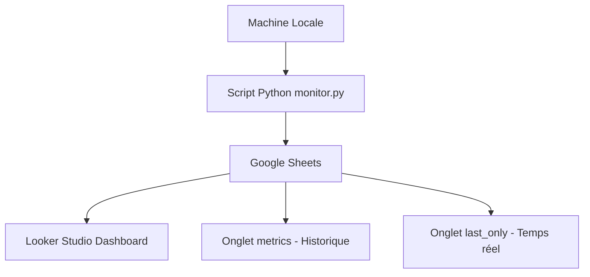

# 🖥️ System Monitoring Dashboard

##  Objectif du projet

Mettre en place un système de monitoring temps réel permettant de :

- Visualiser les performances système
- Identifier les anomalies potentielles
- Suivre les tendances d’utilisation
- Anticiper les surcharges

---

##  Architecture du projet

Le système repose sur un pipeline de données simple :

1. Collecte des métriques via `psutil`
2. Envoi des données vers Google Sheets via `gspread`
3. Visualisation via Looker Studio

---

##  Schéma du Pipeline

---

##  Métriques collectées

- CPU %
- RAM %
- Disk %
- Swap %
- Process Count
- Network Sent / Received (MB)
- CPU Temperature (si disponible)

---

##  Technologies utilisées

- Python
- psutil
- gspread
- Google Sheets API
- Looker Studio
- GitHub

---

##  Fonctionnement

Le script `monitor.py` :

- Collecte les métriques toutes les 60 secondes
- Ajoute une ligne dans l’onglet `metrics`
- Met à jour la ligne 2 dans `last_only`
- Permet une visualisation historique et temps réel

---

##  Dashboard

Le dashboard comprend :

- Graphiques temporels (CPU, RAM, Disk, Swap)
- Monitoring réseau (Sent / Received)
- Process Count
- KPI en temps réel
- Mise à jour automatique (15 minutes via Google Sheets)

